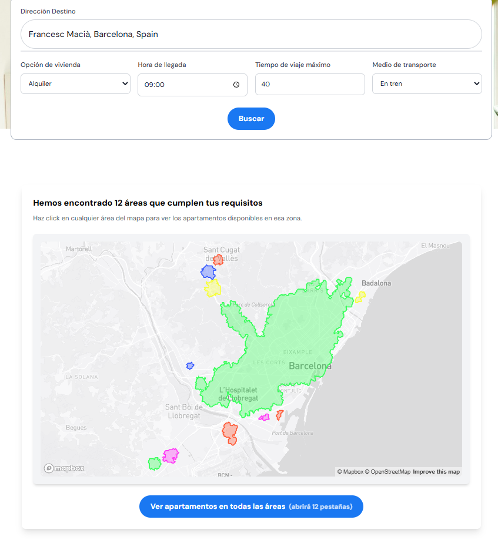
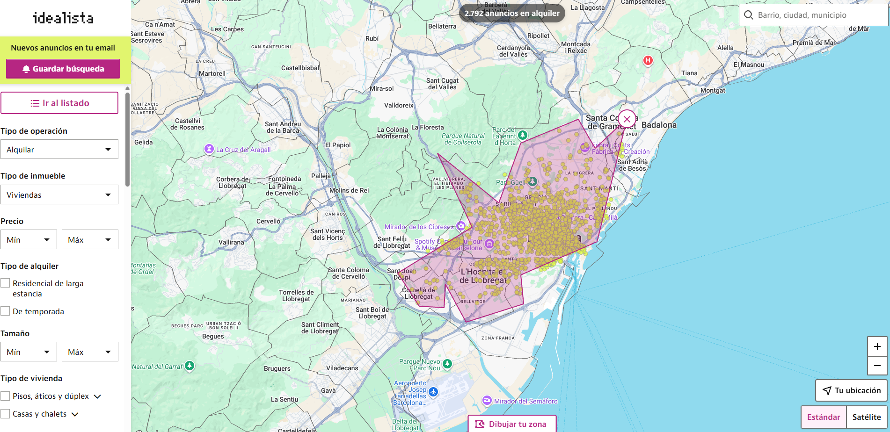
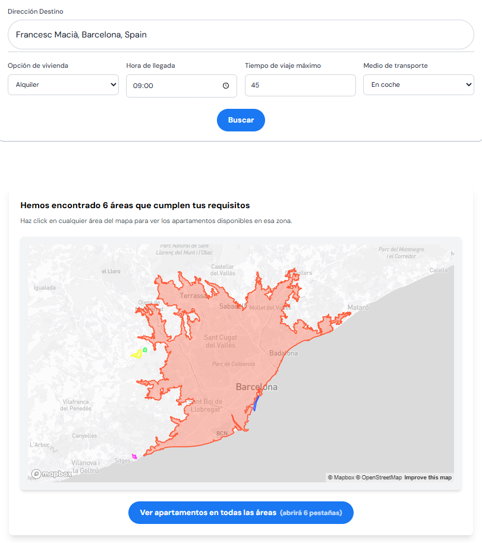
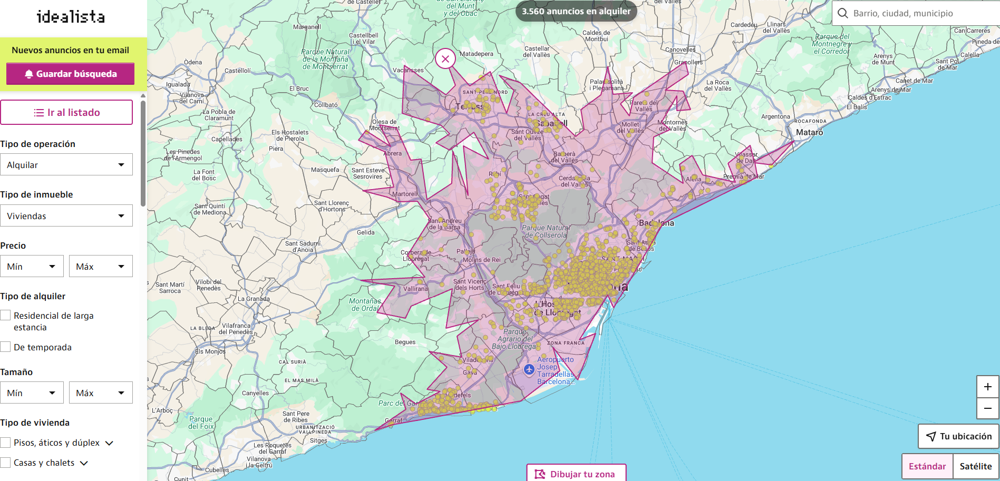
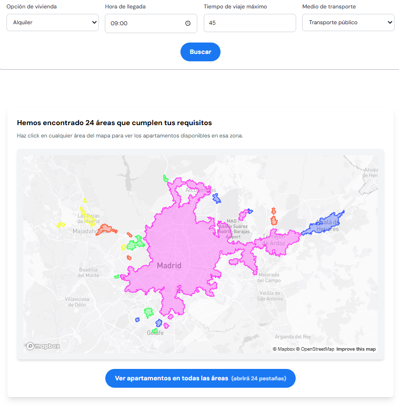
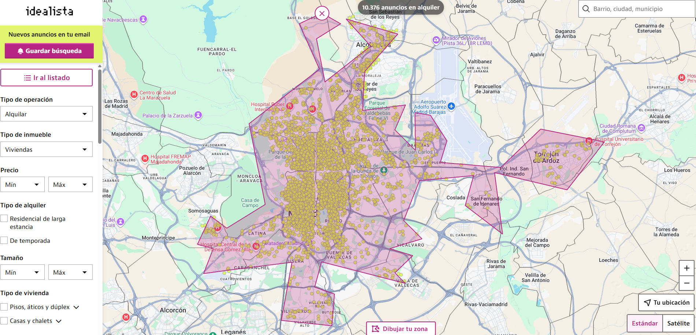

# CasaCerca

Find apartments and rooms based on **commute time** from a chosen address.

CasaCerca lets users input:
- Destination address
- Desired arrival time
- Maximum travel time
- Transport method (car, walking, bike, public transport)
- Housing type (rent room, rent, buy)

The system calculates a **travel-time isochrone** (reachable area within the time limit), then builds Idealista search URLs so users can view listings inside that area.

## Screenshots







## How It Works
**Frontend (React + Vite + Mapbox + Google Places)**
1. User enters address + preferences.
2. Google Places Autocomplete + Geocoding resolves the destination to coordinates.
3. Frontend sends the request to the backend.
4. Results are displayed as colored isochrone polygons on a Mapbox map.
5. Clicking an area opens Idealista for that zone.

**Backend (Flask)**
1. Calls the TravelTime API to generate isochrone polygons.
2. Simplifies polygons and builds Idealista URLs.
3. Returns polygons + URLs + an optional combined map image.

## Repo Structure
```
CasaCerca/
  frontend/   # React + Vite UI
  backend/    # Flask API
```

## Setup
### 1) Backend
```
cd backend
python -m venv .venv
.venv\Scripts\activate
pip install -r requirements.txt
copy .env.example .env
python server.py
```

### 2) Frontend
```
cd frontend
npm install
copy .env.example .env
npm run dev
```

Frontend runs at `http://localhost:5173` and expects the backend at `http://localhost:3001`.

## Environment Variables
**Backend (`backend/.env`)**
- `TRAVELTIME_APP_ID`
- `TRAVELTIME_API_KEY`
- `GOOGLE_API_KEY` (for the backend-rendered `index.html`)

**Frontend (`frontend/.env`)**
- `VITE_API_URL` (backend URL, e.g. `http://localhost:3001`)
- `VITE_SITE_URL` (site URL for metadata)
- `VITE_MAPBOX_TOKEN` (Mapbox public token)
- `VITE_GOOGLE_MAPS_API_KEY` (Google Maps JS API key)

> Note: Google Maps keys are client-side by design. Restrict them by HTTP referrer in Google Cloud Console.

## Notes
- This repo is prepared to be public. Secrets are **not** committed.
- For deployment, set environment variables in your hosting provider (Render, Fly, etc.).

